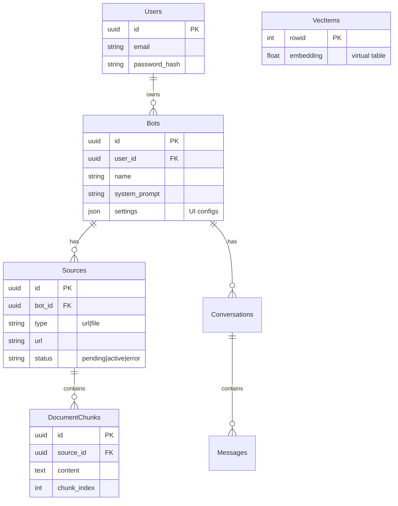

# System Architecture

## High-Level Architecture

```mermaid
graph TD
    Client[React SPA (Dashboard)]
    Widget[Embeddable Widget (ShadowDOM)]
    LB[Load Balancer / Gateway]
    API[Go Backend (Gin)]
    
    subgraph "Data Layer (SQLite + WAL)"
        SQLite[(SQLite DB)]
        Vectors[sqlite-vec Extension]
        SQLite --- Vectors
    end
    
    subgraph "Async Processing"
        Queue[Internal Queue (Channel/SQLite)]
        Worker[Go Worker Functions]
    end
    
    subgraph "External Services"
        OpenAI[OpenAI API]
        Polar[Polar.sh (Payments)]
        TargetSites[Target Websites]
    end

    Client -->|HTTPS| LB
    Widget -->|HTTPS (Public API)| LB
    LB --> API
    
    API -->|CRUD/RAG| SQLite
    API -->|Enqueue Jobs| Queue
    
    Worker -->|Consume Jobs| Queue
    Worker -->|Scrape HTML| TargetSites
    Worker -->|Generate Embeddings| OpenAI
    Worker -->|Store Vectors| SQLite
    
    API -->|Chat Completions| OpenAI
    API -->|Webhooks| Polar
```

## Core Components

### 1. API Server (Monolith)
- **Role**: Handles all HTTP requests for the dashboard, public widget, and webhooks.
- **Framework**: Gin Web Framework.
- **Key Modules**:
    - `auth`: JWT middleware, Role-Based Access Control (RBAC).
    - `handlers`: HTTP controllers (Bots, Sources, Chat).
    - `middleware`: Rate limiting, CORS, Request logging.
    - `repository`: Data access layer (GORM) wrapping SQLite queries.

### 2. Background Worker
- **Role**: Handles long-running or resource-intensive tasks (Scraping, Embeddings).
- **Mechanism**: Go Channels (MVP) or SQLite-backed Persistent Queue (Growth).
- **Tasks**:
    - `process_source`: Fetches HTML, cleans text, chunks content, generates embeddings.

### 3. Database Layer (SQLite)
- **Strategy**: Single-node SQLite database in **WAL mode**.
- **Vector Search**: `sqlite-vec` extension for in-process vector similarity search.
- **Backup**: LiteStream (planned) for streaming replication to S3-compatible storage.

## Data Flow & Processes

### Ingestion Pipeline (RAG)
1.  **Input**: User submits a URL via Dashboard.
2.  **Queue**: API creates `Source` (status: `pending`) and pushes job to internal queue.
3.  **Processing**:
    - Worker picks up job.
    - Fetches URL & Extracts text.
    - Splits into chunks (~500 tokens).
4.  **Embedding**:
    - Chunks sent to OpenAI `text-embedding-3-small`.
    - Returns float vector.
    - **Storage**: Vectors saved to `vec_items` virtual table; Metadata to `document_chunks`.
5.  **Completion**: Source status updated to `active`.

### Retrieval & Generation
1.  **Query**: Widget sends user message + `bot_id`.
2.  **Vector Search**:
    - Convert user message to embedding.
    - SQL Query: `SELECT rowid, distance FROM vec_items WHERE embedding MATCH ? ORDER BY distance LIMIT 5`.
    - Join `rowid` with `document_chunks` to get text content.
3.  **Synthesis**:
    - Construct system prompt with retrieved context.
    - Stream request to OpenAI.
4.  **Response**: Server-Sent Events (SSE) stream tokens to client.

## Database Schema (Simplified)


